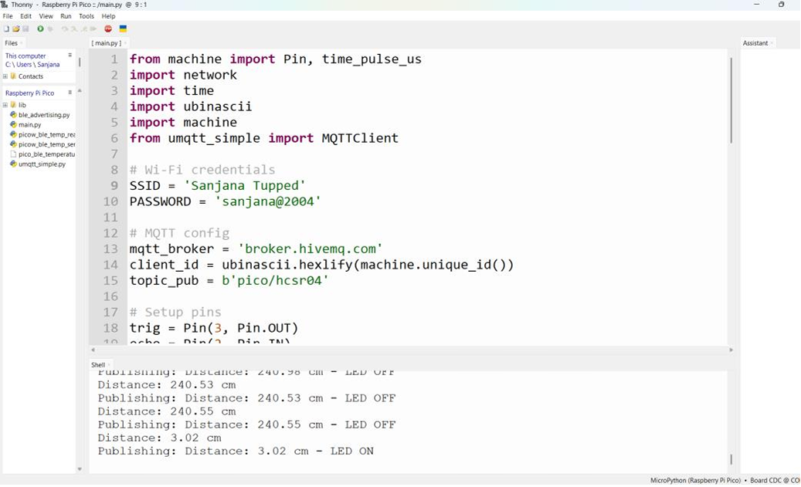

## Project Output

### Source Code and Live Output

The screenshot below shows the MicroPython implementation running on Raspberry Pi Pico W using the Thonny IDE. It demonstrates real-time distance measurement from
the HC-SR04 ultrasonic sensor and automatic LED control based on the detected object distance.
